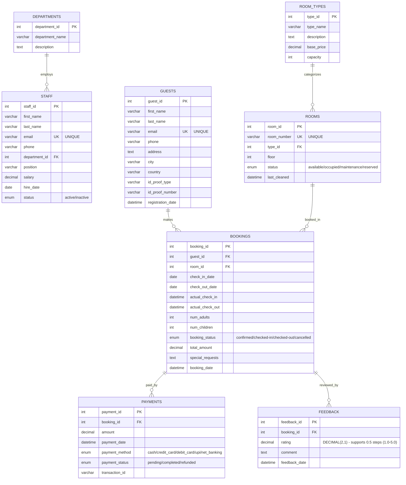

# Hotel Management System - ER Diagram (Mermaid)

This diagram can be rendered in GitHub, VS Code with Mermaid extension, or online at https://mermaid.live/

## Entity Relationship Diagram



## How to Render

### Option 1: GitHub
Just view this file on GitHub - Mermaid is automatically rendered.

### Option 2: VS Code
1. Install "Markdown Preview Mermaid Support" extension
2. Open this file and press `Ctrl+Shift+V` (preview)

### Option 3: Online
1. Copy the mermaid code block above
2. Go to https://mermaid.live/
3. Paste and export as PNG/SVG

### Option 4: CLI (requires Node.js)
```bash
npm install -g @mermaid-js/mermaid-cli
mmdc -i ER_DIAGRAM_MERMAID.md -o ER_DIAGRAM.png
```

## Relationship Summary

| Relationship | Parent → Child | Type | Description |
|--------------|----------------|------|-------------|
| employs | DEPARTMENTS → STAFF | 1:N | Each department has multiple staff |
| categorizes | ROOM_TYPES → ROOMS | 1:N | Each room type has multiple rooms |
| makes | GUESTS → BOOKINGS | 1:N | Each guest can make multiple bookings |
| booked_in | ROOMS → BOOKINGS | 1:N | Each room can have multiple bookings |
| paid_by | BOOKINGS → PAYMENTS | 1:N | Each booking can have multiple payments |
| reviewed_by | BOOKINGS → FEEDBACK | 1:N | Each booking can have multiple feedback entries |

## Key Features
- ✅ All 8 entities with complete attributes
- ✅ Primary keys (PK) and Foreign keys (FK) marked
- ✅ Unique constraints (UK) indicated
- ✅ ENUM types documented with values
- ✅ DECIMAL(2,1) rating for half-star support (3.5, 4.5, etc.)
- ✅ All relationships with cardinality (1:N)
